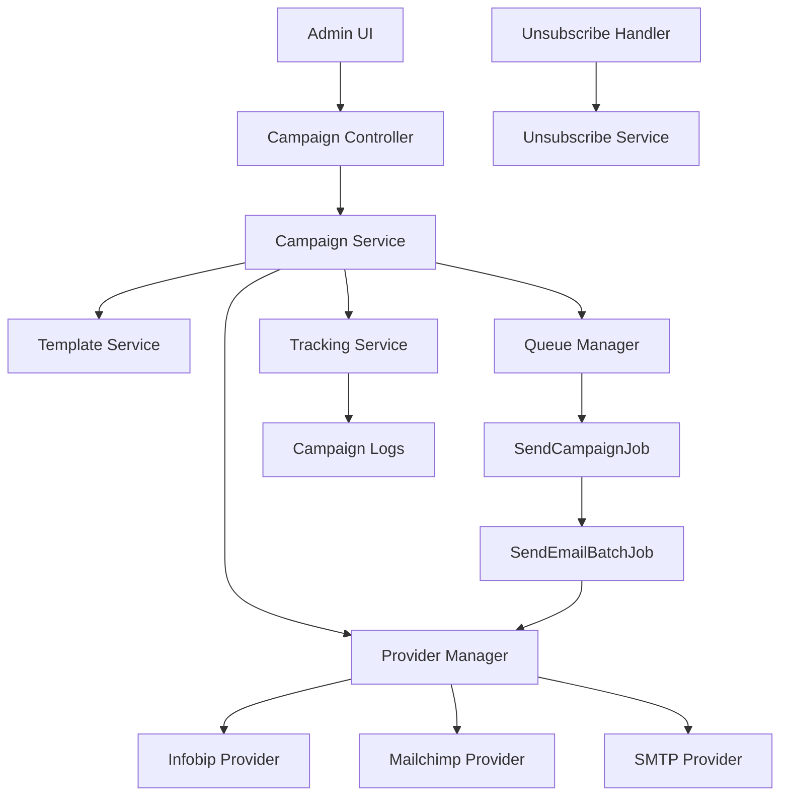

# Email Campaigns and Templates System - Design Document

## Overview

The Email Campaigns system enables event organizers to create, manage, and send personalized email campaigns to event registrants and external recipients. The system provides a unified interface for multiple email service providers (Infobip, Mailchimp, SMTP) with queue-based sending, comprehensive tracking, and compliance features.

### Key Design Goals

1. **Provider Abstraction**: Unified interface for multiple email providers with seamless failover
2. **Scalability**: Handle campaigns with 50,000+ recipients through queue-based batch processing
3. **Reliability**: Retry mechanisms, rate limiting, and graceful error handling
4. **Personalization**: Merge code system for dynamic content insertion
5. **Compliance**: Built-in GDPR and CAN-SPAM compliance features
6. **Observability**: Real-time tracking and comprehensive analytics

### Architecture Principles

- **Service Layer Pattern**: Business logic encapsulated in service classes
- **Strategy Pattern**: Pluggable email provider implementations
- **Queue-Based Processing**: Laravel Jobs for asynchronous sending
- **Event Scoping**: Automatic filtering by event_id and org_id
- **Hash-Based Security**: No database IDs exposed in URLs

## Architecture

### High-Level Architecture



### Component Interaction Flow

**Campaign Creation Flow:**
1. Admin creates campaign via UI
2. CampaignController validates input
3. CampaignService creates campaign record
4. RecipientService resolves recipients (DB query or CSV upload)
5. Campaign queued for sending

**Email Sending Flow:**
1. SendCampaignJob dispatched
2. Recipients chunked into batches (100 per batch)
3. SendEmailBatchJob dispatched for each batch
4. ProviderManager selects active provider
5. MergeCodeService processes template with recipient data
6. Provider sends email
7. TrackingService logs result
8. Retry on failure (max 3 attempts)

**Tracking Flow:**
1. Provider webhook receives event (open, click, bounce)
2. WebhookController validates signature
3. TrackingService updates campaign log
4. Statistics aggregated in real-time

## Components and Interfaces

### 1. Email Template Management

#### TemplateService

Handles all template operations including CRUD, validation, and preview.

```php
class TemplateService
{
    public function create(array $data): EmailTemplate
    public function update(EmailTemplate $template, array $data): EmailTemplate
    public function delete(EmailTemplate $template): bool
    public function clone(EmailTemplate $template, string $newName): EmailTemplate
    public function preview(EmailTemplate $template, array $sampleData): string
    public function validateMergeCodes(string $content): array
    public function getAvailableMergeCodes(): array
    public function renderTemplate(EmailTemplate $template, array $data): array
}
```

**Key Methods:**
- `create()`: Creates new template with validation
- `validateMergeCodes()`: Parses content and validates all {{merge_codes}}
- `renderTemplate()`: Replaces merge codes with actual data, returns ['html' => ..., 'text' => ...]
- `preview()`: Renders template with sample data for preview

#### MergeCodeService

Processes merge codes in templates and provides available codes.

```php
class MergeCodeService
{
    public function parse(string $content): array
    public function replace(string $content, array $data): string
    public function getStandardCodes(): array
    public function getCustomCodes(Event $event): array
    public function validate(array $codes): array
    public function getDefaultValue(string $code): string
}
```

**Standard Merge Codes:**
- `{{first_name}}`, `{{last_name}}`, `{{email}}`
- `{{company}}`, `{{registration_number}}`
- `{{event_name}}`, `{{event_date}}`, `{{event_location}}`
- `{{unsubscribe_url}}` (automatically generated)

**Custom Codes:**
- Dynamically generated from registration custom fields
- Format: `{{custom_field_name}}`

### 2. Campaign Management

#### CampaignService

Core service for campaign lifecycle management.

```php
class CampaignService
{
    public function create(array $data): EmailCampaign
    public function update(EmailCampaign $campaign, array $data): EmailCampaign
    public function delete(EmailCampaign $campaign): bool
    public function schedule(EmailCampaign $campaign, ?Carbon $sendAt = null): void
    public function send(EmailCampaign $campaign): void
    public function pause(EmailCampaign $campaign): void
    public function resume(EmailCampaign $campaign): void
    public function cancel(EmailCampaign $campaign): void
    public function getStatistics(EmailCampaign $campaign): array
    public function exportReport(EmailCampaign $campaign): string
}
```

**Campaign States:**
- `draft`: Being created, not sent
- `scheduled`: Queued for future sending
- `sending`: Currently being processed
- `paused`: Temporarily stopped
- `completed`: All emails sent
- `cancelled`: Stopped by user
- `failed`: Critical error occurred

#### RecipientService

Manages recipient resolution and segmentation.

```php
class RecipientService
{
    public function resolveFromRegistrations(array $filters): Collection
    public function resolveFromCsv(UploadedFile $file, array $mapping): Collection
    public function resolveFromSegment(Segment $segment): Collection
    public function validateRecipients(Collection $recipients): array
    public function deduplicateEmails(Collection $recipients): Collection
    public function excludeUnsubscribed(Collection $recipients): Collection
    public function getRecipientCount(array $filters): int
}
```

**Recipient Sources:**
1. **Registrations**: Query from registrations table with filters
2. **CSV Upload**: Parse and map CSV columns to merge codes
3. **Saved Segments**: Reusable filter configurations

**Filters:**
- Registration category
- Payment status
- Check-in status
- Registration date range
- Custom field values

### 3. Email Provider Integration

#### EmailProviderInterface

Contract that all providers must implement.

```php
interface EmailProviderInterface
{
    public function send(string $to, string $subject, string $html, string $text, array $metadata): string
    public function sendBatch(array $recipients, string $subject, string $html, string $text): array
    public function getStatus(string $messageId): array
    public function getStatistics(string $campaignId): array
    public function testConnection(): bool
    public function supportsTracking(): bool
    public function getWebhookUrl(): string
    public function validateWebhook(Request $request): bool
}
```

**Return Values:**
- `send()`: Returns message ID from provider
- `sendBatch()`: Returns array of ['email' => 'message_id']
- `getStatus()`: Returns ['status' => 'delivered|bounced|failed', 'timestamp' => ...]
- `getStatistics()`: Returns ['sent' => N, 'delivered' => N, 'opened' => N, 'clicked' => N]

#### ProviderManager

Manages provider selection, failover, and configuration.

```php
class ProviderManager
{
    public function getProvider(?string $name = null): EmailProviderInterface
    public function setDefaultProvider(string $name): void
    public function testProvider(string $name, array $config): bool
    public function registerProvider(string $name, string $class): void
    public function getAvailableProviders(): array
    public function handleFailover(Exception $e, EmailProviderInterface $provider): EmailProviderInterface
}
```

**Provider Implementations:**

1. **InfobipProvider**
   - Uses Infobip Email API
   - Supports tracking (opens, clicks)
   - Rate limit: 100 emails/second
   - Webhook support for events

2. **MailchimpProvider**
   - Uses Mailchimp Transactional API (Mandrill)
   - Supports tracking and analytics
   - Rate limit: 50 emails/second
   - Advanced analytics dashboard

3. **SmtpProvider**
   - Uses Laravel Mail (SMTP)
   - Basic tracking (sent/failed only)
   - Rate limit: Configurable
   - Fallback option

**Failover Logic:**
1. Try primary provider
2. On failure, log error
3. Switch to SMTP fallback
4. Retry with exponential backoff

### 4. Queue Management

#### SendCampaignJob

Main job that orchestrates campaign sending.

```php
class SendCampaignJob implements ShouldQueue
{
    use Dispatchable, InteractsWithQueue, Queueable, SerializesModels;
    
    public function __construct(
        public EmailCampaign $campaign
    ) {}
    
    public function handle(CampaignService $service): void
    {
        // 1. Load recipients
        // 2. Chunk into batches (100 per batch)
        // 3. Dispatch SendEmailBatchJob for each batch
        // 4. Update campaign status
    }
    
    public function failed(Throwable $exception): void
    {
        // Mark campaign as failed
        // Notify admin
    }
}
```

#### SendEmailBatchJob

Sends a batch of emails to recipients.

```php
class SendEmailBatchJob implements ShouldQueue
{
    use Dispatchable, InteractsWithQueue, Queueable, SerializesModels;
    
    public $tries = 3;
    public $backoff = [60, 300, 900]; // 1min, 5min, 15min
    
    public function __construct(
        public EmailCampaign $campaign,
        public Collection $recipients,
        public int $batchNumber
    ) {}
    
    public function handle(
        ProviderManager $providerManager,
        TemplateService $templateService,
        TrackingService $trackingService
    ): void
    {
        // 1. Get provider
        // 2. Render template for each recipient
        // 3. Send batch
        // 4. Log results
    }
    
    public function middleware(): array
    {
        return [new RateLimited('email-sending')];
    }
}
```

**Queue Configuration:**
- Queue name: `emails`
- Workers: Scalable (start with 2)
- Batch size: 100 emails
- Rate limit: 100 emails/minute (configurable per provider)
- Retry: 3 attempts with exponential backoff

### 5. Tracking and Analytics

#### TrackingService

Handles all tracking and analytics operations.

```php
class TrackingService
{
    public function logSent(EmailCampaign $campaign, string $email, string $messageId): void
    public function logDelivered(string $messageId): void
    public function logOpened(string $messageId): void
    public function logClicked(string $messageId, string $url): void
    public function logBounced(string $messageId, string $reason): void
    public function logFailed(string $messageId, string $error): void
    public function getRecipientStatus(EmailCampaign $campaign, string $email): array
    public function getCampaignStatistics(EmailCampaign $campaign): array
    public function aggregateStatistics(EmailCampaign $campaign): void
}
```

**Tracked Events:**
- `sent`: Email queued for sending
- `delivered`: Provider confirmed delivery
- `opened`: Recipient opened email (tracking pixel)
- `clicked`: Recipient clicked link
- `bounced`: Email bounced (hard or soft)
- `failed`: Sending failed
- `unsubscribed`: Recipient unsubscribed

**Statistics Aggregation:**
```php
[
    'total_recipients' => 1000,
    'sent' => 1000,
    'delivered' => 980,
    'opened' => 450,
    'clicked' => 120,
    'bounced' => 15,
    'failed' => 5,
    'unsubscribed' => 3,
    'delivery_rate' => 98.0,
    'open_rate' => 45.9,
    'click_rate' => 12.2,
    'bounce_rate' => 1.5,
]
```

### 6. Compliance Features

#### UnsubscribeService

Manages unsubscribe requests and preferences.

```php
class UnsubscribeService
{
    public function unsubscribe(string $email, ?string $reason = null): void
    public function resubscribe(string $email): void
    public function isUnsubscribed(string $email): bool
    public function getUnsubscribeUrl(string $email, EmailCampaign $campaign): string
    public function handleUnsubscribeRequest(Request $request): void
    public function exportUnsubscribeList(): Collection
}
```

**Unsubscribe Mechanism:**
1. Every email includes `{{unsubscribe_url}}`
2. URL format: `/event/unsubscribe/{hash}`
3. Hash contains encrypted email + campaign ID
4. One-click unsubscribe (no login required)
5. Confirmation page with optional reason
6. Immediate effect (no delay)

**GDPR Compliance:**
- Right to be forgotten: Delete all recipient data
- Data export: Export all campaign data for a recipient
- Consent tracking: Log when consent was given
- Audit trail: Track all email communications

## Data Models

### EmailTemplate Model

```php
class EmailTemplate extends Model
{
    use HasEventScope, HasHashedRoutes, SoftDeletes;
    
    protected $fillable = [
        'event_id',
        'org_id',
        'name',
        'slug',
        'category',
        'subject',
        'html_content',
        'text_content',
        'description',
        'is_active',
        'usage_count',
    ];
    
    protected $casts = [
        'is_active' => 'boolean',
        'usage_count' => 'integer',
    ];
    
    // Relationships
    public function campaigns()
    {
        return $this->hasMany(EmailCampaign::class);
    }
    
    // Scopes
    public function scopeActive($query)
    {
        return $query->where('is_active', true);
    }
    
    public function scopeByCategory($query, string $category)
    {
        return $query->where('category', $category);
    }
}
```

**Categories:**
- `invitation`: Event invitations
- `reminder`: Event reminders
- `confirmation`: Registration confirmations
- `update`: Event updates
- `thank_you`: Post-event thank you
- `custom`: Custom templates

### EmailCampaign Model

```php
class EmailCampaign extends Model
{
    use HasEventScope, HasHashedRoutes, SoftDeletes;
    
    protected $fillable = [
        'event_id',
        'org_id',
        'email_template_id',
        'name',
        'description',
        'sender_name',
        'sender_email',
        'reply_to_email',
        'status',
        'recipient_source',
        'recipient_filters',
        'scheduled_at',
        'started_at',
        'completed_at',
        'paused_at',
        'cancelled_at',
        'total_recipients',
        'sent_count',
        'delivered_count',
        'opened_count',
        'clicked_count',
        'bounced_count',
        'failed_count',
        'unsubscribed_count',
        'provider_name',
    ];
    
    protected $casts = [
        'recipient_filters' => 'array',
        'scheduled_at' => 'datetime',
        'started_at' => 'datetime',
        'completed_at' => 'datetime',
        'paused_at' => 'datetime',
        'cancelled_at' => 'datetime',
        'total_recipients' => 'integer',
        'sent_count' => 'integer',
        'delivered_count' => 'integer',
        'opened_count' => 'integer',
        'clicked_count' => 'integer',
        'bounced_count' => 'integer',
        'failed_count' => 'integer',
        'unsubscribed_count' => 'integer',
    ];
    
    // Relationships
    public function template()
    {
        return $this->belongsTo(EmailTemplate::class, 'email_template_id');
    }
    
    public function recipients()
    {
        return $this->hasMany(EmailCampaignRecipient::class);
    }
    
    public function logs()
    {
        return $this->hasMany(EmailCampaignLog::class);
    }
    
    // Scopes
    public function scopeByStatus($query, string $status)
    {
        return $query->where('status', $status);
    }
    
    public function scopeScheduled($query)
    {
        return $query->where('status', 'scheduled')
                     ->where('scheduled_at', '<=', now());
    }
    
    // Accessors
    public function getDeliveryRateAttribute(): float
    {
        return $this->sent_count > 0 
            ? ($this->delivered_count / $this->sent_count) * 100 
            : 0;
    }
    
    public function getOpenRateAttribute(): float
    {
        return $this->delivered_count > 0 
            ? ($this->opened_count / $this->delivered_count) * 100 
            : 0;
    }
    
    public function getClickRateAttribute(): float
    {
        return $this->delivered_count > 0 
            ? ($this->clicked_count / $this->delivered_count) * 100 
            : 0;
    }
}
```

### EmailCampaignRecipient Model

```php
class EmailCampaignRecipient extends Model
{
    use HasEventScope;
    
    protected $fillable = [
        'event_id',
        'org_id',
        'email_campaign_id',
        'email',
        'first_name',
        'last_name',
        'merge_data',
        'status',
        'message_id',
        'sent_at',
        'delivered_at',
        'opened_at',
        'clicked_at',
        'bounced_at',
        'failed_at',
        'error_message',
    ];
    
    protected $casts = [
        'merge_data' => 'array',
        'sent_at' => 'datetime',
        'delivered_at' => 'datetime',
        'opened_at' => 'datetime',
        'clicked_at' => 'datetime',
        'bounced_at' => 'datetime',
        'failed_at' => 'datetime',
    ];
    
    // Relationships
    public function campaign()
    {
        return $this->belongsTo(EmailCampaign::class, 'email_campaign_id');
    }
}
```

**Recipient Status:**
- `pending`: Queued for sending
- `sent`: Sent to provider
- `delivered`: Confirmed delivered
- `opened`: Recipient opened
- `clicked`: Recipient clicked link
- `bounced`: Email bounced
- `failed`: Sending failed

### EmailCampaignLog Model

```php
class EmailCampaignLog extends Model
{
    use HasEventScope;
    
    protected $fillable = [
        'event_id',
        'org_id',
        'email_campaign_id',
        'email_campaign_recipient_id',
        'event_type',
        'message_id',
        'email',
        'url',
        'metadata',
        'occurred_at',
    ];
    
    protected $casts = [
        'metadata' => 'array',
        'occurred_at' => 'datetime',
    ];
    
    // Relationships
    public function campaign()
    {
        return $this->belongsTo(EmailCampaign::class, 'email_campaign_id');
    }
    
    public function recipient()
    {
        return $this->belongsTo(EmailCampaignRecipient::class, 'email_campaign_recipient_id');
    }
}
```

**Event Types:**
- `sent`, `delivered`, `opened`, `clicked`, `bounced`, `failed`, `unsubscribed`

### EmailProviderConfig Model

```php
class EmailProviderConfig extends Model
{
    use HasEventScope;
    
    protected $fillable = [
        'event_id',
        'org_id',
        'provider_name',
        'credentials',
        'settings',
        'is_active',
        'is_default',
        'last_tested_at',
        'test_status',
    ];
    
    protected $casts = [
        'credentials' => 'encrypted:array',
        'settings' => 'array',
        'is_active' => 'boolean',
        'is_default' => 'boolean',
        'last_tested_at' => 'datetime',
    ];
    
    // Scopes
    public function scopeActive($query)
    {
        return $query->where('is_active', true);
    }
    
    public function scopeDefault($query)
    {
        return $query->where('is_default', true);
    }
}
```

**Provider Credentials:**
- Infobip: `api_key`, `base_url`
- Mailchimp: `api_key`
- SMTP: `host`, `port`, `username`, `password`, `encryption`

### EmailUnsubscribe Model

```php
class EmailUnsubscribe extends Model
{
    use HasEventScope;
    
    protected $fillable = [
        'event_id',
        'org_id',
        'email',
        'reason',
        'unsubscribed_at',
        'ip_address',
        'user_agent',
    ];
    
    protected $casts = [
        'unsubscribed_at' => 'datetime',
    ];
    
    // Scopes
    public function scopeByEmail($query, string $email)
    {
        return $query->where('email', $email);
    }
}
```

### Database Schema

**Migration: email_templates**
```php
Schema::create('email_templates', function (Blueprint $table) {
    $table->id();
    $table->unsignedBigInteger('event_id')->index();
    $table->unsignedBigInteger('org_id')->index();
    $table->string('name');
    $table->string('slug')->unique();
    $table->string('category')->index();
    $table->string('subject');
    $table->longText('html_content');
    $table->longText('text_content')->nullable();
    $table->text('description')->nullable();
    $table->boolean('is_active')->default(true);
    $table->integer('usage_count')->default(0);
    $table->timestamps();
    $table->softDeletes();
    
    $table->index(['event_id', 'org_id']);
});
```

**Migration: email_campaigns**
```php
Schema::create('email_campaigns', function (Blueprint $table) {
    $table->id();
    $table->unsignedBigInteger('event_id')->index();
    $table->unsignedBigInteger('org_id')->index();
    $table->unsignedBigInteger('email_template_id');
    $table->string('name');
    $table->text('description')->nullable();
    $table->string('sender_name');
    $table->string('sender_email');
    $table->string('reply_to_email')->nullable();
    $table->string('status')->index();
    $table->string('recipient_source');
    $table->json('recipient_filters')->nullable();
    $table->timestamp('scheduled_at')->nullable();
    $table->timestamp('started_at')->nullable();
    $table->timestamp('completed_at')->nullable();
    $table->timestamp('paused_at')->nullable();
    $table->timestamp('cancelled_at')->nullable();
    $table->integer('total_recipients')->default(0);
    $table->integer('sent_count')->default(0);
    $table->integer('delivered_count')->default(0);
    $table->integer('opened_count')->default(0);
    $table->integer('clicked_count')->default(0);
    $table->integer('bounced_count')->default(0);
    $table->integer('failed_count')->default(0);
    $table->integer('unsubscribed_count')->default(0);
    $table->string('provider_name')->nullable();
    $table->timestamps();
    $table->softDeletes();
    
    $table->index(['event_id', 'org_id']);
    $table->foreign('email_template_id')->references('id')->on('email_templates');
});
```

**Migration: email_campaign_recipients**
```php
Schema::create('email_campaign_recipients', function (Blueprint $table) {
    $table->id();
    $table->unsignedBigInteger('event_id')->index();
    $table->unsignedBigInteger('org_id')->index();
    $table->unsignedBigInteger('email_campaign_id')->index();
    $table->string('email')->index();
    $table->string('first_name')->nullable();
    $table->string('last_name')->nullable();
    $table->json('merge_data')->nullable();
    $table->string('status')->index();
    $table->string('message_id')->nullable()->index();
    $table->timestamp('sent_at')->nullable();
    $table->timestamp('delivered_at')->nullable();
    $table->timestamp('opened_at')->nullable();
    $table->timestamp('clicked_at')->nullable();
    $table->timestamp('bounced_at')->nullable();
    $table->timestamp('failed_at')->nullable();
    $table->text('error_message')->nullable();
    $table->timestamps();
    
    $table->index(['event_id', 'org_id']);
    $table->foreign('email_campaign_id')->references('id')->on('email_campaigns')->onDelete('cascade');
});
```

**Migration: email_campaign_logs**
```php
Schema::create('email_campaign_logs', function (Blueprint $table) {
    $table->id();
    $table->unsignedBigInteger('event_id')->index();
    $table->unsignedBigInteger('org_id')->index();
    $table->unsignedBigInteger('email_campaign_id')->index();
    $table->unsignedBigInteger('email_campaign_recipient_id')->nullable()->index();
    $table->string('event_type')->index();
    $table->string('message_id')->nullable()->index();
    $table->string('email')->index();
    $table->string('url')->nullable();
    $table->json('metadata')->nullable();
    $table->timestamp('occurred_at');
    $table->timestamps();
    
    $table->index(['event_id', 'org_id']);
    $table->foreign('email_campaign_id')->references('id')->on('email_campaigns')->onDelete('cascade');
    $table->foreign('email_campaign_recipient_id')->references('id')->on('email_campaign_recipients')->onDelete('set null');
});
```

**Migration: email_provider_configs**
```php
Schema::create('email_provider_configs', function (Blueprint $table) {
    $table->id();
    $table->unsignedBigInteger('event_id')->index();
    $table->unsignedBigInteger('org_id')->index();
    $table->string('provider_name')->index();
    $table->text('credentials'); // Encrypted
    $table->json('settings')->nullable();
    $table->boolean('is_active')->default(true);
    $table->boolean('is_default')->default(false);
    $table->timestamp('last_tested_at')->nullable();
    $table->string('test_status')->nullable();
    $table->timestamps();
    
    $table->index(['event_id', 'org_id']);
    $table->unique(['event_id', 'org_id', 'provider_name']);
});
```

**Migration: email_unsubscribes**
```php
Schema::create('email_unsubscribes', function (Blueprint $table) {
    $table->id();
    $table->unsignedBigInteger('event_id')->index();
    $table->unsignedBigInteger('org_id')->index();
    $table->string('email')->index();
    $table->string('reason')->nullable();
    $table->timestamp('unsubscribed_at');
    $table->string('ip_address')->nullable();
    $table->string('user_agent')->nullable();
    $table->timestamps();
    
    $table->index(['event_id', 'org_id']);
    $table->unique(['event_id', 'org_id', 'email']);
});
```


## Correctness Properties

*A property is a characteristic or behavior that should hold true across all valid executions of a system—essentially, a formal statement about what the system should do. Properties serve as the bridge between human-readable specifications and machine-verifiable correctness guarantees.*

### Property 1: Merge Code Validation Correctness

*For any* template content string, if it contains merge codes in the format `{{code_name}}`, then the validation function should identify all merge codes and correctly classify them as valid (in the standard or custom code list) or invalid (not in either list).

**Validates: Requirements AC-1.2**

### Property 2: Merge Code Replacement Completeness

*For any* template content with valid merge codes and any complete data map, replacing merge codes should result in content where no valid merge code patterns remain unreplaced, and all replaced values match the provided data.

**Validates: Requirements AC-1.2**

### Property 3: Template Cloning Equivalence

*For any* email template, cloning it with a new name should produce a template where all content fields (subject, html_content, text_content, category) are identical to the original, but the name and slug are different.

**Validates: Requirements AC-1.3**

### Property 4: Recipient Email Deduplication

*For any* collection of recipients, deduplicating by email address should result in a collection where each email appears exactly once, and the total count equals the number of unique emails in the original collection.

**Validates: Requirements AC-2.2**

### Property 5: CSV Email Validation

*For any* CSV file with an email column, validating emails should correctly identify all rows where the email field matches RFC 5322 email format as valid, and all others as invalid.

**Validates: Requirements AC-2.2**

### Property 6: Campaign Statistics Consistency

*For any* campaign with tracked events, the sum of delivered_count, bounced_count, and failed_count should equal sent_count, and opened_count should never exceed delivered_count.

**Validates: Requirements AC-2.4**

### Property 7: Provider Credential Encryption Round-Trip

*For any* provider configuration with credentials, storing the credentials (which encrypts them) and then retrieving them should produce credentials identical to the original input.

**Validates: Requirements AC-3.1**

### Property 8: Queue Batch Processing Completeness

*For any* campaign with N recipients and batch size B, dispatching batch jobs should create exactly ceil(N/B) jobs, and the union of all batch recipients should equal the original recipient list.

**Validates: Requirements AC-3.3**

### Property 9: Job Retry Limit Enforcement

*For any* failed email job, the retry mechanism should attempt sending at most 3 times total (initial attempt + 2 retries), and after the 3rd failure, the job should be marked as permanently failed.

**Validates: Requirements AC-3.3**

### Property 10: Unsubscribe Immediate Effect

*For any* email address, after calling the unsubscribe function, any subsequent recipient resolution should exclude that email address from the results.

**Validates: Requirements US-10 (Compliance)**

### Property 11: Event Scope Isolation

*For any* two different event_id values, creating templates/campaigns in one event should never be visible when querying from the other event context.

**Validates: Requirements (Multi-tenancy - implicit in all requirements)**

## Error Handling

### Template Errors

**Invalid Merge Codes:**
- Detection: Parse template content and validate against available codes
- Response: Return validation error with list of invalid codes
- User Action: Fix merge codes or remove them

**Missing Required Fields:**
- Detection: Validate presence of name, subject, html_content
- Response: Return 422 Unprocessable Entity with field errors
- User Action: Provide missing fields

**Duplicate Slug:**
- Detection: Check uniqueness before save
- Response: Auto-generate alternative slug or return error
- User Action: Choose different name

### Campaign Errors

**No Recipients Found:**
- Detection: Recipient count = 0 after applying filters
- Response: Prevent campaign creation with clear message
- User Action: Adjust filters or upload recipients

**Template Not Found:**
- Detection: Template ID doesn't exist or is soft-deleted
- Response: Return 404 with suggestion to select different template
- User Action: Select active template

**Scheduled Time in Past:**
- Detection: scheduled_at < now()
- Response: Return validation error
- User Action: Choose future time or send immediately

### Provider Errors

**API Authentication Failure:**
- Detection: Provider returns 401/403
- Response: Log error, mark provider as failed, attempt failover
- Retry: No retry, switch to fallback provider
- User Action: Update provider credentials

**Rate Limit Exceeded:**
- Detection: Provider returns 429
- Response: Pause sending, wait for rate limit reset
- Retry: Exponential backoff (1min, 5min, 15min)
- User Action: None (automatic)

**Network Timeout:**
- Detection: Request timeout after 30 seconds
- Response: Log error, mark email as failed
- Retry: Up to 3 attempts with exponential backoff
- User Action: None (automatic)

**Invalid Recipient Email:**
- Detection: Provider rejects email format
- Response: Mark recipient as failed, continue with others
- Retry: No retry for invalid format
- User Action: Fix email in recipient data

### Queue Errors

**Job Timeout:**
- Detection: Job exceeds max execution time (5 minutes)
- Response: Kill job, mark batch as failed
- Retry: Retry entire batch (up to 3 times)
- User Action: Contact support if persistent

**Memory Exhaustion:**
- Detection: PHP memory limit reached
- Response: Reduce batch size, restart job
- Retry: Automatic with smaller batches
- User Action: None (automatic)

**Database Connection Lost:**
- Detection: Database query fails
- Response: Release job back to queue
- Retry: Automatic retry after 60 seconds
- User Action: None (automatic)

### Data Validation Errors

**CSV Parse Error:**
- Detection: Invalid CSV format or encoding
- Response: Return error with line number and issue
- User Action: Fix CSV file and re-upload

**Missing Merge Code Data:**
- Detection: Merge code in template but no data for recipient
- Response: Use default value or empty string, log warning
- Retry: No retry
- User Action: Review template or provide complete data

**Email Bounce:**
- Detection: Provider webhook reports bounce
- Response: Mark recipient as bounced, update statistics
- Retry: No retry for hard bounces, retry soft bounces once
- User Action: Clean recipient list

### Error Logging

All errors are logged with:
- Timestamp
- Error type and message
- Campaign ID and recipient email (if applicable)
- Provider name
- Stack trace (for system errors)
- Request ID for tracing

### Error Notifications

**Critical Errors** (notify admin immediately):
- All providers failed
- Campaign stuck in sending state > 1 hour
- Database connection lost
- Queue worker crashed

**Warning Errors** (daily digest):
- High bounce rate (> 10%)
- High failure rate (> 5%)
- Provider failover occurred
- Slow sending rate

## Testing Strategy

### Dual Testing Approach

The email campaigns system requires both unit tests and property-based tests for comprehensive coverage:

**Unit Tests** focus on:
- Specific examples of merge code replacement
- Edge cases (empty recipient lists, malformed CSV)
- Error conditions (invalid provider credentials, network failures)
- Integration points (controller → service → provider)
- Webhook signature validation

**Property-Based Tests** focus on:
- Universal properties across all inputs (see Correctness Properties)
- Randomized template content with merge codes
- Large recipient lists (1,000 - 10,000 recipients)
- Various campaign configurations
- Provider failover scenarios

### Property-Based Testing Configuration

**Framework:** Pest PHP with property-based testing plugin

**Configuration:**
- Minimum 100 iterations per property test
- Each test tagged with: `Feature: email-campaigns, Property N: [property description]`
- Generators for: templates, campaigns, recipients, merge codes, provider responses

**Example Test Structure:**
```php
test('Property 2: Merge code replacement completeness', function () {
    // Feature: email-campaigns, Property 2: Merge code replacement completeness
    
    forAll(
        templateContentGenerator(),
        mergeDataGenerator()
    )->then(function ($content, $data) {
        $service = new MergeCodeService();
        $result = $service->replace($content, $data);
        
        // No valid merge codes should remain
        $remainingCodes = $service->parse($result);
        expect($remainingCodes)->toBeEmpty();
        
        // All data values should appear in result
        foreach ($data as $value) {
            expect($result)->toContain($value);
        }
    })->runs(100);
});
```

### Test Coverage Requirements

**Unit Test Coverage:**
- Services: 90%+ line coverage
- Controllers: 80%+ line coverage
- Models: 70%+ line coverage
- Providers: 85%+ line coverage

**Property Test Coverage:**
- All 11 correctness properties must have corresponding tests
- Each property test runs minimum 100 iterations
- Tests must use randomized inputs, not fixed examples

### Integration Testing

**Campaign End-to-End Flow:**
1. Create template with merge codes
2. Create campaign with recipients
3. Queue campaign for sending
4. Process queue jobs
5. Verify all recipients processed
6. Check statistics accuracy

**Provider Failover:**
1. Configure primary and fallback providers
2. Simulate primary provider failure
3. Verify automatic failover to fallback
4. Verify emails sent successfully via fallback

**Webhook Processing:**
1. Send campaign
2. Simulate provider webhooks (opened, clicked, bounced)
3. Verify tracking logs created
4. Verify statistics updated correctly

### Performance Testing

**Load Tests:**
- Campaign with 50,000 recipients
- 100 emails/minute sending rate
- Verify queue processing completes within expected time
- Monitor memory usage and database connections

**Stress Tests:**
- Multiple concurrent campaigns
- Provider rate limit handling
- Database query optimization
- Queue worker scaling

### Security Testing

**Input Validation:**
- XSS in template content
- SQL injection in filters
- Email header injection
- CSV injection attacks

**Authentication:**
- Admin-only routes protected
- Provider credentials encrypted
- Webhook signature validation
- Unsubscribe token validation

### Compliance Testing

**GDPR:**
- Unsubscribe mechanism works
- Data export functionality
- Right to be forgotten
- Consent tracking

**CAN-SPAM:**
- Physical address in footer
- Unsubscribe link in all emails
- Accurate sender information
- Opt-out honored within 10 days

## Implementation Notes

### Rich Text Editor

Use TinyMCE for template editing:
- Toolbar: formatting, images, links, merge code picker
- Custom plugin for merge code insertion
- Preview mode with sample data
- HTML and plain text views

### Queue Configuration

**Redis Queue (Recommended):**
```php
// config/queue.php
'connections' => [
    'redis' => [
        'driver' => 'redis',
        'connection' => 'default',
        'queue' => 'emails',
        'retry_after' => 300,
        'block_for' => null,
    ],
],
```

**Worker Command:**
```bash
php artisan queue:work redis --queue=emails --tries=3 --timeout=300
```

### Rate Limiting

**Laravel Rate Limiter:**
```php
// app/Providers/AppServiceProvider.php
RateLimiter::for('email-sending', function () {
    return Limit::perMinute(100);
});
```

### Caching Strategy

**Cache Keys:**
- `email_template:{id}`: Template content (1 hour)
- `email_provider:{name}:config`: Provider config (1 hour)
- `email_unsubscribes:{event_id}`: Unsubscribe list (5 minutes)
- `email_campaign:{id}:stats`: Campaign statistics (1 minute)

### Monitoring and Observability

**Metrics to Track:**
- Queue depth and processing rate
- Email sending rate per provider
- Error rate by type
- Campaign completion time
- Provider failover frequency

**Logging:**
- All campaign actions (create, send, pause, cancel)
- Provider API calls and responses
- Queue job failures
- Webhook events

**Alerts:**
- Queue depth > 10,000
- Error rate > 5%
- Provider failover
- Campaign stuck > 1 hour

### Scalability Considerations

**Horizontal Scaling:**
- Multiple queue workers can process jobs concurrently
- Database read replicas for statistics queries
- Redis cluster for queue distribution

**Vertical Scaling:**
- Increase batch size for faster processing
- Optimize database queries with indexes
- Cache frequently accessed data

**Database Optimization:**
- Index on `email_campaign_recipients.status` for filtering
- Index on `email_campaign_logs.message_id` for webhook lookups
- Partition `email_campaign_logs` by date for old data archival

### Security Considerations

**Credential Storage:**
- Provider credentials encrypted using Laravel's encryption
- Encryption key stored in environment variable
- Key rotation supported

**Email Content Sanitization:**
- Strip dangerous HTML tags (script, iframe)
- Validate URLs in links
- Escape user input in merge codes

**Webhook Security:**
- Validate provider signatures
- Rate limit webhook endpoints
- Log all webhook requests

**Access Control:**
- Only event admins can create campaigns
- Provider configs only visible to admins
- Audit log for all sensitive actions

