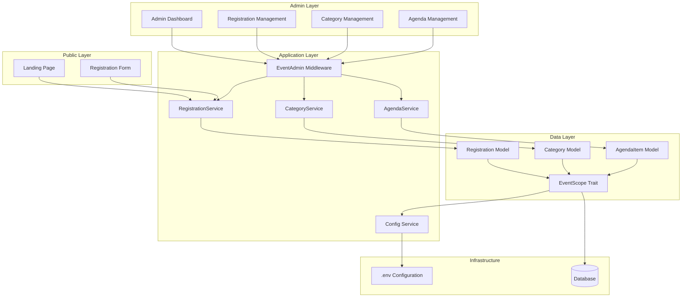
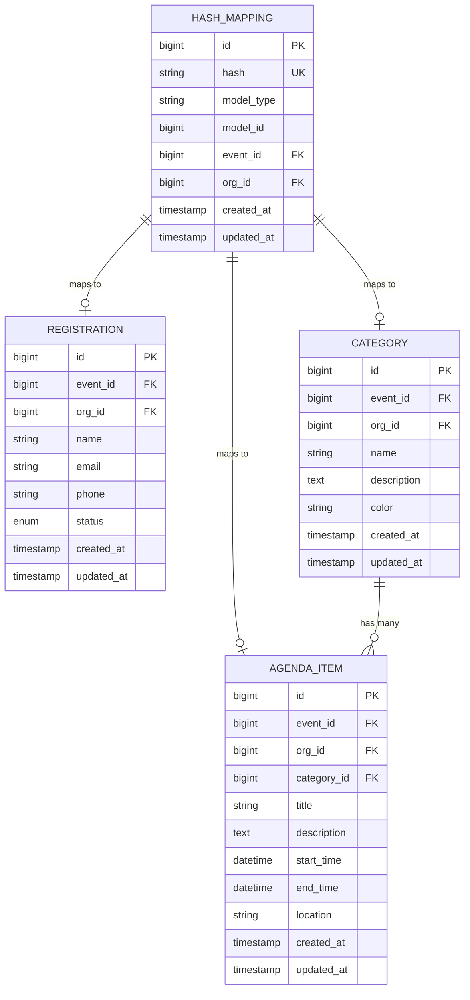

# Design Document: Laravel Event Manager

## Overview

The Laravel Event Manager is a Blade-based web application designed to manage a single event within a SaaS ecosystem. The architecture emphasizes multi-tenancy readiness through org_id and event_id columns while maintaining focus on a single event instance loaded from environment configuration.

The system consists of three main functional areas:
1. **Public Landing Page** - Displays event information, categories, and agenda
2. **Admin Panel** - Manages registrations, categories, and agenda items
3. **Data Layer** - Enforces automatic event/org filtering through global scopes

## Architecture

### High-Level Architecture



### Architectural Principles

1. **Single Event Focus**: All operations are scoped to one event loaded from ENV
2. **Multi-Tenant Ready**: org_id and event_id columns enable future expansion
3. **Automatic Filtering**: Global scopes enforce data isolation transparently
4. **Service Layer Pattern**: Business logic separated from controllers
5. **Blade Components**: Reusable UI components for consistency

### Directory Structure

```
app/
├── Http/
│   ├── Controllers/
│   │   ├── EventController.php
│   │   └── Admin/
│   │       ├── DashboardController.php
│   │       ├── RegistrationController.php
│   │       ├── CategoryController.php
│   │       └── AgendaController.php
│   └── Middleware/
│       └── EventAdmin.php
├── Models/
│   ├── Registration.php
│   ├── Category.php
│   ├── AgendaItem.php
│   └── HashMapping.php
├── Services/
│   ├── RegistrationService.php
│   ├── CategoryService.php
│   ├── AgendaService.php
│   └── HashService.php
└── Traits/
    ├── HasEventScope.php
    └── HasHashedRoutes.php

config/
└── event.php

resources/
└── views/
    ├── event/
    │   ├── landing.blade.php
    │   └── register.blade.php
    ├── admin/
    │   ├── dashboard.blade.php
    │   ├── registrations/
    │   ├── categories/
    │   └── agenda/
    └── components/
        ├── event-card.blade.php
        ├── category-badge.blade.php
        └── agenda-item.blade.php

database/
└── migrations/
    ├── xxxx_create_hash_mappings_table.php
    ├── xxxx_create_registrations_table.php
    ├── xxxx_create_categories_table.php
    └── xxxx_create_agenda_items_table.php
```

## Components and Interfaces

### Database Connection

The application connects to an existing database that is part of the larger SaaS ecosystem. Database credentials are configured in the .env file:

```
DB_CONNECTION=mysql
DB_HOST=127.0.0.1
DB_PORT=3306
DB_DATABASE=saas_database
DB_USERNAME=username
DB_PASSWORD=password
```

The application will:
1. Connect to the existing database
2. Create new tables for event management (registrations, categories, agenda_items, hash_mappings)
3. Not modify any existing tables in the database
4. Use the existing database's org_id and event_id conventions

### Hash-Based URL Security

To prevent ID enumeration attacks and enhance security, all edit and delete URLs use hashed identifiers instead of database IDs.

#### HashMapping Model

```php
class HashMapping extends Model
{
    protected $fillable = ['hash', 'model_type', 'model_id', 'event_id', 'org_id'];
    
    public function hashable()
    {
        return $this->morphTo('model', 'model_type', 'model_id');
    }
}
```

#### HashService

Service class that manages hash generation and resolution:

```php
class HashService
{
    public function generateHash($model): string
    {
        $hash = bin2hex(random_bytes(16)); // 32-character hash
        
        HashMapping::create([
            'hash' => $hash,
            'model_type' => get_class($model),
            'model_id' => $model->id,
            'event_id' => config('event.event_id'),
            'org_id' => config('event.org_id'),
        ]);
        
        return $hash;
    }
    
    public function resolveHash(string $hash, string $modelType)
    {
        $mapping = HashMapping::where('hash', $hash)
            ->where('model_type', $modelType)
            ->where('event_id', config('event.event_id'))
            ->where('org_id', config('event.org_id'))
            ->firstOrFail();
        
        return $modelType::findOrFail($mapping->model_id);
    }
    
    public function getHash($model): ?string
    {
        $mapping = HashMapping::where('model_type', get_class($model))
            ->where('model_id', $model->id)
            ->where('event_id', config('event.event_id'))
            ->where('org_id', config('event.org_id'))
            ->first();
        
        return $mapping?->hash;
    }
}
```

#### HasHashedRoutes Trait

Trait applied to models that need hashed URLs:

```php
trait HasHashedRoutes
{
    protected static function bootHasHashedRoutes()
    {
        static::created(function ($model) {
            app(HashService::class)->generateHash($model);
        });
    }
    
    public function getHashAttribute(): ?string
    {
        return app(HashService::class)->getHash($this);
    }
    
    public function getRouteKey()
    {
        return $this->hash ?? $this->getKey();
    }
    
    public function getRouteKeyName()
    {
        return 'hash';
    }
}
```

### Configuration Layer

#### config/event.php

Configuration file that loads event and organization identifiers from environment:

```php
return [
    'event_id' => env('EVENT_ID'),
    'org_id' => env('ORG_ID'),
];
```

#### EventServiceProvider

Service provider that validates configuration on boot:

```php
public function boot()
{
    if (empty(config('event.event_id'))) {
        throw new \RuntimeException('EVENT_ID must be configured in .env');
    }
    
    if (empty(config('event.org_id'))) {
        throw new \RuntimeException('ORG_ID must be configured in .env');
    }
}
```

### Data Layer

#### HasEventScope Trait

Trait applied to all models to automatically filter by event_id and org_id:

```php
trait HasEventScope
{
    protected static function bootHasEventScope()
    {
        static::addGlobalScope('event', function (Builder $builder) {
            $builder->where('event_id', config('event.event_id'))
                    ->where('org_id', config('event.org_id'));
        });
        
        static::creating(function ($model) {
            if (empty($model->event_id)) {
                $model->event_id = config('event.event_id');
            }
            if (empty($model->org_id)) {
                $model->org_id = config('event.org_id');
            }
        });
    }
}
```

#### Models

**Registration Model**:
```php
class Registration extends Model
{
    use HasEventScope, HasHashedRoutes;
    
    protected $fillable = [
        'name', 'email', 'phone', 'status', 
        'event_id', 'org_id'
    ];
    
    protected $casts = [
        'registered_at' => 'datetime',
    ];
}
```

**Category Model**:
```php
class Category extends Model
{
    use HasEventScope, HasHashedRoutes;
    
    protected $fillable = [
        'name', 'description', 'color', 
        'event_id', 'org_id'
    ];
    
    public function agendaItems()
    {
        return $this->hasMany(AgendaItem::class);
    }
}
```

**AgendaItem Model**:
```php
class AgendaItem extends Model
{
    use HasEventScope, HasHashedRoutes;
    
    protected $fillable = [
        'title', 'description', 'start_time', 'end_time',
        'location', 'category_id', 'event_id', 'org_id'
    ];
    
    protected $casts = [
        'start_time' => 'datetime',
        'end_time' => 'datetime',
    ];
    
    public function category()
    {
        return $this->belongsTo(Category::class);
    }
}
```

### Service Layer

#### RegistrationService

Handles registration business logic:

```php
class RegistrationService
{
    public function createRegistration(array $data): Registration
    {
        // Validation and business logic
        return Registration::create($data);
    }
    
    public function getAllRegistrations()
    {
        return Registration::orderBy('created_at', 'desc')->get();
    }
    
    public function updateRegistration(Registration $registration, array $data): Registration
    {
        $registration->update($data);
        return $registration->fresh();
    }
    
    public function deleteRegistration(Registration $registration): bool
    {
        return $registration->delete();
    }
}
```

#### CategoryService

Handles category business logic:

```php
class CategoryService
{
    public function createCategory(array $data): Category
    {
        return Category::create($data);
    }
    
    public function getAllCategories()
    {
        return Category::orderBy('name')->get();
    }
    
    public function updateCategory(Category $category, array $data): Category
    {
        $category->update($data);
        return $category->fresh();
    }
    
    public function deleteCategory(Category $category): bool
    {
        return $category->delete();
    }
}
```

#### AgendaService

Handles agenda business logic:

```php
class AgendaService
{
    public function createAgendaItem(array $data): AgendaItem
    {
        return AgendaItem::create($data);
    }
    
    public function getAllAgendaItems()
    {
        return AgendaItem::with('category')
            ->orderBy('start_time')
            ->get();
    }
    
    public function updateAgendaItem(AgendaItem $item, array $data): AgendaItem
    {
        $item->update($data);
        return $item->fresh();
    }
    
    public function deleteAgendaItem(AgendaItem $item): bool
    {
        return $item->delete();
    }
}
```

### Controller Layer

#### EventController

Handles public-facing routes:

```php
class EventController extends Controller
{
    public function __construct(
        private CategoryService $categoryService,
        private AgendaService $agendaService
    ) {}
    
    public function landing()
    {
        $categories = $this->categoryService->getAllCategories();
        $agendaItems = $this->agendaService->getAllAgendaItems();
        
        return view('event.landing', compact('categories', 'agendaItems'));
    }
    
    public function showRegistrationForm()
    {
        return view('event.register');
    }
    
    public function storeRegistration(Request $request, RegistrationService $service)
    {
        $validated = $request->validate([
            'name' => 'required|string|max:255',
            'email' => 'required|email',
            'phone' => 'nullable|string',
        ]);
        
        $service->createRegistration($validated);
        
        return redirect()->route('event.landing')
            ->with('success', 'Registration successful!');
    }
}
```

#### Admin Controllers

**DashboardController**:
```php
class DashboardController extends Controller
{
    public function index(
        RegistrationService $registrationService,
        CategoryService $categoryService,
        AgendaService $agendaService
    ) {
        $stats = [
            'registrations_count' => $registrationService->getAllRegistrations()->count(),
            'categories_count' => $categoryService->getAllCategories()->count(),
            'agenda_items_count' => $agendaService->getAllAgendaItems()->count(),
        ];
        
        return view('admin.dashboard', compact('stats'));
    }
}
```

**RegistrationController**:
```php
class RegistrationController extends Controller
{
    public function __construct(
        private RegistrationService $service,
        private HashService $hashService
    ) {}
    
    public function index()
    {
        $registrations = $this->service->getAllRegistrations();
        return view('admin.registrations.index', compact('registrations'));
    }
    
    public function create()
    {
        return view('admin.registrations.create');
    }
    
    public function store(Request $request)
    {
        $validated = $request->validate([
            'name' => 'required|string|max:255',
            'email' => 'required|email',
            'phone' => 'nullable|string',
            'status' => 'required|in:pending,confirmed,cancelled',
        ]);
        
        $this->service->createRegistration($validated);
        
        return redirect()->route('admin.registrations.index')
            ->with('success', 'Registration created successfully');
    }
    
    public function edit(string $hash)
    {
        $registration = $this->hashService->resolveHash($hash, Registration::class);
        return view('admin.registrations.edit', compact('registration'));
    }
    
    public function update(Request $request, string $hash)
    {
        $registration = $this->hashService->resolveHash($hash, Registration::class);
        
        $validated = $request->validate([
            'name' => 'required|string|max:255',
            'email' => 'required|email',
            'phone' => 'nullable|string',
            'status' => 'required|in:pending,confirmed,cancelled',
        ]);
        
        $this->service->updateRegistration($registration, $validated);
        
        return redirect()->route('admin.registrations.index')
            ->with('success', 'Registration updated successfully');
    }
    
    public function destroy(string $hash)
    {
        $registration = $this->hashService->resolveHash($hash, Registration::class);
        $this->service->deleteRegistration($registration);
        
        return redirect()->route('admin.registrations.index')
            ->with('success', 'Registration deleted successfully');
    }
}
```

Similar patterns apply to CategoryController and AgendaController, using HashService to resolve hashes.

### Middleware Layer

#### EventAdmin Middleware

Protects admin routes:

```php
class EventAdmin
{
    public function handle(Request $request, Closure $next)
    {
        if (!auth()->check()) {
            return redirect()->route('login')
                ->with('error', 'Please login to access admin panel');
        }
        
        // Additional role/permission checks can be added here
        
        return $next($request);
    }
}
```

Register in `app/Http/Kernel.php`:
```php
protected $middlewareAliases = [
    'event.admin' => \App\Http\Middleware\EventAdmin::class,
];
```

### Routing Layer

#### routes/web.php

```php
// Public routes
Route::prefix('event')->name('event.')->group(function () {
    Route::get('/', [EventController::class, 'landing'])->name('landing');
    Route::get('/register', [EventController::class, 'showRegistrationForm'])->name('register.form');
    Route::post('/register', [EventController::class, 'storeRegistration'])->name('register.store');
});

// Admin routes
Route::prefix('event/admin')
    ->name('admin.')
    ->middleware(['event.admin'])
    ->group(function () {
        Route::get('/dashboard', [DashboardController::class, 'index'])->name('dashboard');
        
        Route::resource('registrations', RegistrationController::class);
        Route::resource('categories', CategoryController::class);
        Route::resource('agenda', AgendaController::class);
    });
```

## Data Models

### Database Schema

#### hash_mappings table

```php
Schema::create('hash_mappings', function (Blueprint $table) {
    $table->id();
    $table->string('hash', 32)->unique();
    $table->string('model_type');
    $table->unsignedBigInteger('model_id');
    $table->unsignedBigInteger('event_id')->index();
    $table->unsignedBigInteger('org_id')->index();
    $table->timestamps();
    
    $table->index(['hash', 'model_type']);
    $table->index(['model_type', 'model_id']);
    $table->index(['event_id', 'org_id']);
});
```

#### registrations table

```php
Schema::create('registrations', function (Blueprint $table) {
    $table->id();
    $table->unsignedBigInteger('event_id')->index();
    $table->unsignedBigInteger('org_id')->index();
    $table->string('name');
    $table->string('email');
    $table->string('phone')->nullable();
    $table->enum('status', ['pending', 'confirmed', 'cancelled'])->default('pending');
    $table->timestamps();
    
    $table->index(['event_id', 'org_id']);
});
```

#### categories table

```php
Schema::create('categories', function (Blueprint $table) {
    $table->id();
    $table->unsignedBigInteger('event_id')->index();
    $table->unsignedBigInteger('org_id')->index();
    $table->string('name');
    $table->text('description')->nullable();
    $table->string('color', 7)->nullable(); // Hex color code
    $table->timestamps();
    
    $table->index(['event_id', 'org_id']);
});
```

#### agenda_items table

```php
Schema::create('agenda_items', function (Blueprint $table) {
    $table->id();
    $table->unsignedBigInteger('event_id')->index();
    $table->unsignedBigInteger('org_id')->index();
    $table->unsignedBigInteger('category_id')->nullable();
    $table->string('title');
    $table->text('description')->nullable();
    $table->dateTime('start_time');
    $table->dateTime('end_time');
    $table->string('location')->nullable();
    $table->timestamps();
    
    $table->foreign('category_id')
        ->references('id')
        ->on('categories')
        ->onDelete('set null');
    
    $table->index(['event_id', 'org_id']);
    $table->index('start_time');
});
```

### Entity Relationships




## Correctness Properties

*A property is a characteristic or behavior that should hold true across all valid executions of a system—essentially, a formal statement about what the system should do. Properties serve as the bridge between human-readable specifications and machine-verifiable correctness guarantees.*

### Property 1: Configuration Loading

*For any* valid .env file containing EVENT_ID and ORG_ID values, accessing config('event.event_id') and config('event.org_id') should return those exact values.

**Validates: Requirements 1.1, 1.2**

### Property 2: Automatic Field Assignment

*For any* model using the HasEventScope trait, creating a new instance without explicitly setting event_id or org_id should result in those fields being automatically populated with values from config('event.event_id') and config('event.org_id').

**Validates: Requirements 2.3, 2.4**

### Property 3: Automatic Query Filtering

*For any* model using the HasEventScope trait, querying records should automatically filter results to only include records where event_id matches config('event.event_id') AND org_id matches config('event.org_id'), even when records with different event_id/org_id values exist in the database.

**Validates: Requirements 2.5, 2.6**

### Property 4: Cross-Event Access Prevention

*For any* model using the HasEventScope trait (Registration, Category, AgendaItem), attempting to retrieve, update, or delete a record that belongs to a different event_id than the configured one should fail to find that record due to automatic scope filtering.

**Validates: Requirements 4.4, 4.5, 5.4, 5.5, 6.4, 6.5**

### Property 5: Model Relationships Preserve Scope

*For any* model relationship (e.g., Category->AgendaItems), accessing related records should automatically apply the event scope, ensuring that only related records matching the configured event_id and org_id are returned.

**Validates: Requirements 9.5**

### Property 6: Hash Generation on Model Creation

*For any* model using the HasHashedRoutes trait, creating a new instance should automatically generate a unique hash and store it in the hash_mappings table with the correct event_id and org_id.

**Validates: Requirements 12.2**

### Property 7: Hash Resolution to Correct Model

*For any* valid hash in the hash_mappings table, resolving that hash should return the correct model instance that matches both the hash and the configured event_id/org_id.

**Validates: Requirements 12.3, 12.4, 12.5**

### Property 8: Invalid Hash Returns 404

*For any* invalid or non-existent hash, attempting to resolve it should throw a ModelNotFoundException resulting in a 404 error.

**Validates: Requirements 12.6**

## Error Handling

### Configuration Errors

**Missing EVENT_ID**:
- Exception: `RuntimeException`
- Message: "EVENT_ID must be configured in .env"
- Thrown during: Application boot in EventServiceProvider
- Recovery: Application fails to start; administrator must configure .env

**Missing ORG_ID**:
- Exception: `RuntimeException`
- Message: "ORG_ID must be configured in .env"
- Thrown during: Application boot in EventServiceProvider
- Recovery: Application fails to start; administrator must configure .env

### Authentication Errors

**Unauthenticated Admin Access**:
- Response: HTTP 302 Redirect
- Target: Login route
- Flash message: "Please login to access admin panel"
- Recovery: User must authenticate

### Validation Errors

**Invalid Registration Data**:
- Response: HTTP 422 Unprocessable Entity
- Errors: Laravel validation error bag
- Recovery: User corrects form input and resubmits

**Invalid Category Data**:
- Response: HTTP 422 Unprocessable Entity
- Errors: Laravel validation error bag
- Recovery: User corrects form input and resubmits

**Invalid Agenda Item Data**:
- Response: HTTP 422 Unprocessable Entity
- Errors: Laravel validation error bag
- Common issues: end_time before start_time, missing required fields
- Recovery: User corrects form input and resubmits

### Database Errors

**Foreign Key Constraint Violation**:
- Scenario: Deleting a category that has agenda items
- Behavior: agenda_items.category_id set to NULL (on delete set null)
- Recovery: Automatic; agenda items remain but lose category association

**Duplicate Entry**:
- Response: HTTP 500 or caught and converted to validation error
- Recovery: User modifies data to ensure uniqueness

### Model Not Found Errors

**Registration Not Found**:
- Exception: `ModelNotFoundException`
- Scenario: Accessing registration that doesn't exist or belongs to different event
- Response: HTTP 404
- Recovery: User redirected to index page

**Category Not Found**:
- Exception: `ModelNotFoundException`
- Scenario: Accessing category that doesn't exist or belongs to different event
- Response: HTTP 404
- Recovery: User redirected to index page

**Agenda Item Not Found**:
- Exception: `ModelNotFoundException`
- Scenario: Accessing agenda item that doesn't exist or belongs to different event
- Response: HTTP 404
- Recovery: User redirected to index page

## Testing Strategy

### Dual Testing Approach

The testing strategy employs both unit tests and property-based tests to ensure comprehensive coverage:

- **Unit tests**: Verify specific examples, edge cases, error conditions, and integration points
- **Property tests**: Verify universal properties across all inputs through randomization

Together, these approaches provide comprehensive coverage where unit tests catch concrete bugs and property tests verify general correctness.

### Property-Based Testing

**Library**: Use **Pest PHP** with **pest-plugin-faker** or integrate **QuickCheck-style** property testing for PHP

**Configuration**:
- Each property test must run minimum **100 iterations**
- Each test must reference its design document property using a comment tag
- Tag format: `// Feature: laravel-event-manager, Property {number}: {property_text}`

**Property Test Implementation**:

Each correctness property must be implemented as a single property-based test:

1. **Property 1: Configuration Loading**
   - Generate random EVENT_ID and ORG_ID values
   - Set them in config
   - Verify config returns exact values

2. **Property 2: Automatic Field Assignment**
   - Generate random model instances (Registration, Category, AgendaItem)
   - Create without setting event_id/org_id
   - Verify fields are populated from config

3. **Property 3: Automatic Query Filtering**
   - Generate records with various event_id/org_id combinations
   - Insert into database
   - Query and verify only configured event/org records returned

4. **Property 4: Cross-Event Access Prevention**
   - Generate records with different event_ids
   - Attempt to access records from wrong event
   - Verify they are not accessible

5. **Property 5: Model Relationships Preserve Scope**
   - Generate categories and agenda items with various event_ids
   - Access relationship
   - Verify only items matching configured event returned

### Unit Testing

**Focus Areas**:
- Route existence and accessibility (public vs admin)
- Middleware application and authentication redirects
- Controller method responses and view data
- Service class methods with specific inputs
- Validation rules and error messages
- Database migrations structure (org_id, event_id columns with indexes)
- Blade component rendering

**Example Unit Tests**:

```php
// Route Tests
test('public landing page is accessible', function () {
    $response = $this->get('/event');
    $response->assertStatus(200);
});

test('admin routes require authentication', function () {
    $response = $this->get('/event/admin/dashboard');
    $response->assertRedirect(route('login'));
});

// Migration Tests
test('registrations table has required columns', function () {
    expect(Schema::hasColumns('registrations', [
        'id', 'event_id', 'org_id', 'name', 'email'
    ]))->toBeTrue();
});

test('registrations table has composite index', function () {
    $indexes = Schema::getIndexes('registrations');
    $hasCompositeIndex = collect($indexes)->contains(function ($index) {
        return $index['columns'] === ['event_id', 'org_id'];
    });
    expect($hasCompositeIndex)->toBeTrue();
});

// Service Tests
test('registration service creates registration with correct data', function () {
    $service = new RegistrationService();
    $data = [
        'name' => 'John Doe',
        'email' => 'john@example.com',
        'phone' => '1234567890',
    ];
    
    $registration = $service->createRegistration($data);
    
    expect($registration->name)->toBe('John Doe');
    expect($registration->email)->toBe('john@example.com');
    expect($registration->event_id)->toBe(config('event.event_id'));
});

// Validation Tests
test('registration requires name and email', function () {
    $response = $this->post('/event/register', []);
    $response->assertSessionHasErrors(['name', 'email']);
});

// Configuration Tests
test('missing EVENT_ID throws exception on boot', function () {
    config(['event.event_id' => null]);
    
    expect(fn() => app()->make(EventServiceProvider::class)->boot())
        ->toThrow(RuntimeException::class, 'EVENT_ID must be configured');
});

test('missing ORG_ID throws exception on boot', function () {
    config(['event.org_id' => null]);
    
    expect(fn() => app()->make(EventServiceProvider::class)->boot())
        ->toThrow(RuntimeException::class, 'ORG_ID must be configured');
});

// Trait Tests
test('HasEventScope trait exists and can be used', function () {
    expect(trait_exists('App\\Traits\\HasEventScope'))->toBeTrue();
    expect(class_uses(Registration::class))->toContain('App\\Traits\\HasEventScope');
});

// Service Class Tests
test('required service classes exist', function () {
    expect(class_exists('App\\Services\\RegistrationService'))->toBeTrue();
    expect(class_exists('App\\Services\\CategoryService'))->toBeTrue();
    expect(class_exists('App\\Services\\AgendaService'))->toBeTrue();
});

// Relationship Tests
test('category has many agenda items relationship works', function () {
    $category = Category::factory()->create();
    $agendaItem = AgendaItem::factory()->create(['category_id' => $category->id]);
    
    expect($category->agendaItems)->toHaveCount(1);
    expect($category->agendaItems->first()->id)->toBe($agendaItem->id);
});

test('agenda item belongs to category relationship works', function () {
    $category = Category::factory()->create();
    $agendaItem = AgendaItem::factory()->create(['category_id' => $category->id]);
    
    expect($agendaItem->category->id)->toBe($category->id);
});
```

### Integration Testing

**Focus Areas**:
- End-to-end registration flow (public form submission)
- Admin CRUD operations for registrations, categories, and agenda
- Authentication flow and middleware protection
- Database transactions and rollbacks

### Test Organization

```
tests/
├── Unit/
│   ├── Models/
│   │   ├── RegistrationTest.php
│   │   ├── CategoryTest.php
│   │   └── AgendaItemTest.php
│   ├── Services/
│   │   ├── RegistrationServiceTest.php
│   │   ├── CategoryServiceTest.php
│   │   └── AgendaServiceTest.php
│   ├── Traits/
│   │   └── HasEventScopeTest.php
│   └── Middleware/
│       └── EventAdminTest.php
├── Feature/
│   ├── PublicRoutesTest.php
│   ├── AdminRoutesTest.php
│   ├── RegistrationManagementTest.php
│   ├── CategoryManagementTest.php
│   └── AgendaManagementTest.php
└── Property/
    ├── ConfigurationPropertyTest.php
    ├── AutomaticFieldAssignmentPropertyTest.php
    ├── AutomaticQueryFilteringPropertyTest.php
    ├── CrossEventAccessPropertyTest.php
    └── RelationshipScopePropertyTest.php
```

### Test Data Management

**Factories**:
- Create factories for Registration, Category, and AgendaItem models
- Factories should respect event_id and org_id from config by default
- Allow overriding event_id and org_id for testing cross-event scenarios

**Seeders**:
- Create seeders for demo data
- Useful for local development and manual testing
- Should not be used in automated tests

### Continuous Integration

- Run all tests on every commit
- Enforce minimum code coverage thresholds
- Run property tests with increased iterations in CI (e.g., 500 iterations)
- Fail build on any test failure
